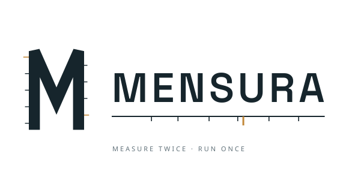

<h1 align="center">
  <picture>
    <source media="(prefers-color-scheme: dark)" srcset="assets/mensura-lockup-dark.svg">
    
  </picture>
</h1>

A statically typed language for data handling.

Mensura is a programming language in which the type system encodes properties
of the *data*, not just the shape of values.  A Mensura table type records how
its rows were sampled, how they depend on one another, where they came from,
and what their columns mean (their schema, units, and semantic types).

Because those properties live in the type, the compiler can reject programs
that are syntactically valid but semantically wrong.  Mistakes that other
tools leave to runtime, convention, or discipline (mixing training and test
data, using the wrong cross-validation strategy on time-ordered data, drawing
a biased sample, comparing quantities in incompatible units) become compile
errors instead.

The language itself is small.  The novelty is in the typing rules attached to
each operation, not in the surface syntax.

## Goals

- Turn data-handling correctness into a compile-time property.
- Prevent whole classes of bugs before a program runs: data leakage, the
  wrong cross-validation strategy on temporal data, biased sampling, and unit
  or semantic mismatches.
- Stay a small, focused language whose power comes from its type system rather
  than from a large surface area.

## Building

Install Rust via [rustup](https://rustup.rs):

```
curl --proto '=https' --tlsv1.2 -sSf https://sh.rustup.rs | sh
```

Mensura requires Rust 1.85 or later (edition 2024).  After installation,
reload your shell and use the `Makefile` targets:

| Target | Command |
|--------|---------|
| `make test` | `cargo test --workspace` |
| `make check` | `cargo clippy --workspace --all-targets -- -D warnings` |
| `make fmt` | `cargo fmt --all` |
| `make install` | installs the `mensura` binary |

### Formal development

The machine-checked proofs behind the type system live in `formal/`, a
Lean 4 project (see `docs/decisions/0021-formal-proof-pipeline.md`).
Two extra tools are needed:

- [elan](https://github.com/leanprover/elan), the Lean toolchain
  manager; the toolchain pinned in `formal/lean-toolchain` is fetched
  automatically.
- [uv](https://docs.astral.sh/uv/), which resolves the Python tooling
  declared in `formal/blueprint/pyproject.toml` (plasTeX and the
  leanblueprint plugins, locked in `formal/blueprint/uv.lock`) on
  first use.  There is no separate install step.

From `formal/` (or with `make -C formal <target>`):

| Target | Effect |
|--------|--------|
| `make cache` | fetch the Mathlib build cache (run once, before the first build) |
| `make build` | `lake build` the Lean development |
| `make axioms` | run the axiom gate (`AxiomCheck.lean`) |
| `make color` | derive blueprint node colors from the code |
| `make web` | render the blueprint dashboard to `formal/blueprint/web/` |
| `make pdf` | build the blueprint PDF (needs a TeX installation) |

CI runs the same build, sorry scan, and axiom gate on every pull
request that touches `formal/`.  The blueprint itself is documented in
`formal/blueprint/README.md`.

## Learn more

See `docs/language/00-overview.md` for what the language is and `ROADMAP.md`
for the phased plan.

## License

Licensed under either of MIT (`LICENSE-MIT`) or Apache License 2.0
(`LICENSE-APACHE`), at your option.
